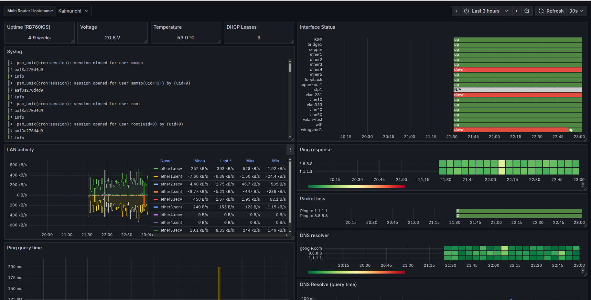
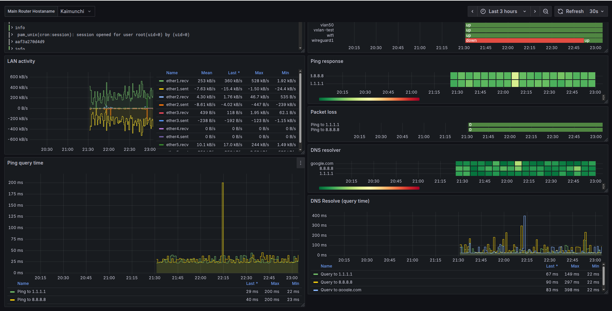

# grafana-router-monitoring
MikroTik Router(RB750Gr3) Monitoring: WAN/LAN Ports using SNMP, Rsyslog, InfluxDB, Telegraf and Grafana

This project provides a comprehensive monitoring solution for MikroTik routers, capturing both WAN and LAN performance metrics along with system logs for visualization and analysis in Grafana.

By combining SNMP, Telegraf, InfluxDB, and Rsyslog, you can track router health, network activity, and troubleshoot issues with clear dashboards.

Features
* WAN & LAN Port Monitoring
  * Interface throughput (Tx/Rx)
  * Packet drops, errors, and utilization

* Real-time  traffic monitor
  * Router interface monitor,dhcp lease, volt and temperature via SNMP OIDs
  * System uptime 

* Syslog Collection with Rsyslog
  * Centralized log aggregation from MikroTik
  * Log monitoring (info, error, warning, critical)

* Network Activity Tracking
  * ICMP ping query time and response
  * DNS resolver query latency

This is simple Mikrotik router monitoring I use in my home network using raspberry PI

My network is quite simple, one Mikrotik router RB760iGS with IP address 192.168.20.1.

## Mikrotik Setup

Enable SNMP on Mikrotik device you want to monitor:

```
/snmp community set [ find default=yes ] name=telegraf
# telegraf is community string name, you can change it based on your requirement
/snmp set enabled=yes
```
Optional: if you want to collect logs from your Mikrotik device, you have to set "remote" action:

```
# Change 192.168.30.249 to your rasp IP address.
/system logging action set remote bsd-syslog=yes remote=192.168.30.249

# Add all log level you wan to send.
/system logging add action=remote topics=info
/system logging add action=remote topics=error
/system logging add action=remote topics=warning
/system logging add action=remote topics=critical
```
# On Raspberry Pi
Make sure to install docker 

## Rsyslog setup
```
sudo ln -s /path_to_mikrotik_configuration/mikrotik.conf /etc/rsyslog.d/mikrotik.conf
sudo systemctl restart rsyslog
```
## Grafana Dashboard





